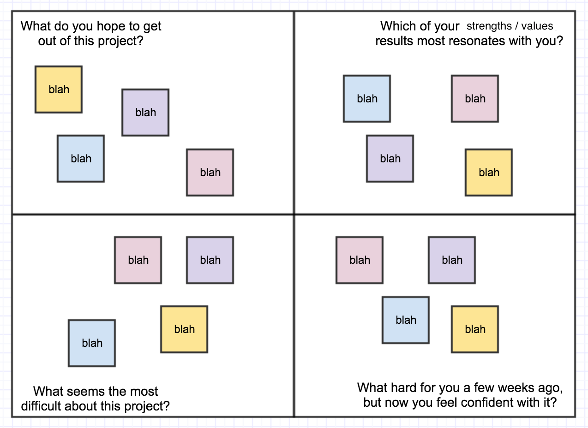

# Team Random Number Guess

In this challenge, you will be creating a number guessing game! You'll have plenty of time to work on this as a group. Start by spending 5 minutes reading through the requirements individually. After reading through the requirements, come together as a group and talk about what you would like to get out of the project.

### Tech: Node, Express, and JavaScript

## Base Mode

You should generate a random number between 1 and 25 on the server. Add input fields to match the number of people in your group. Each member of your group will submit a guess at the same time. All of the guesses should be sent to the server (POST). The server will check each guess against the random number. After submitting a round of guesses, retrieve all of the previous guesses (GET) and display them on the screen. Let each user know whether their guess was correct, too low or too high. 

- an input field for each of the Players to make a guess
- a submit guesses button (submits all guesses at the same time)
- total guesses made indicator (think of this as rounds in a game)
- details area for the history of guesses for each player (tell them if their last guess was too low or too high)
- if a guess is correct PROMINENTLY Display which player won (make 'em FEEL it)
- if there is a winner, a restart button that tells the server to select a new random number (POST)

# Necessary Ingredients (AKA Client Demands)

| |  |
| ----------- | ----------- |
|  | **⚠️ All random number stuff should happen on the server.**    *(Generation of the random number upon game start as well as comparisons between guesses and the random correct answer.)*  |

> Take a moment to discuss with your team members why this is something that a client may demand.
>
>Once you get it working, style it up, yo!

# Stretch Goals:

The list below is not in any order of priority. Before attempting any of these, commit your working base mode. Make sure each member of your group understands what you completed for base mode! 

- have the random number generator be in its own node module, look back at the Module Madness activity to do this.
- allow for users to generate a new game with a manual min/max random number range
- disallow two users to submit the same guess at the same time
- add a bot player that guesses a random number each time in addition to the players (this bot should really talk trash when it beats a bunch of humans)
- what are your ideas? Have some fun with it
